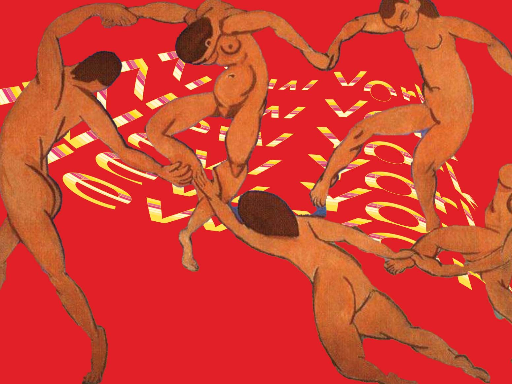

# {{title}}

 <h1 class="design">Multimedia Student Project</h1>
   <h2 class="tool">Tool: Photoshop, Illustrator</h2>   
   <selection class="portfolio">
    

    <h2 class="project-title"><a href="dpfearandcourage.html">Fear and Courage</a></h2>   
   
 
   

    

    

   <h2 class="project-title"><a href="dpprejudice.html">Prejudice</a></h2> 
   
 
    

    

    
   
    

    <h2 class="project-title"><a href="dppostcard.html">Postcard</a></h2>
    
 
   

    

    

    <h2 class="project-title"><a href="dplove.html">Love</a></h2> 
    
 
   

    

    

  </selection>